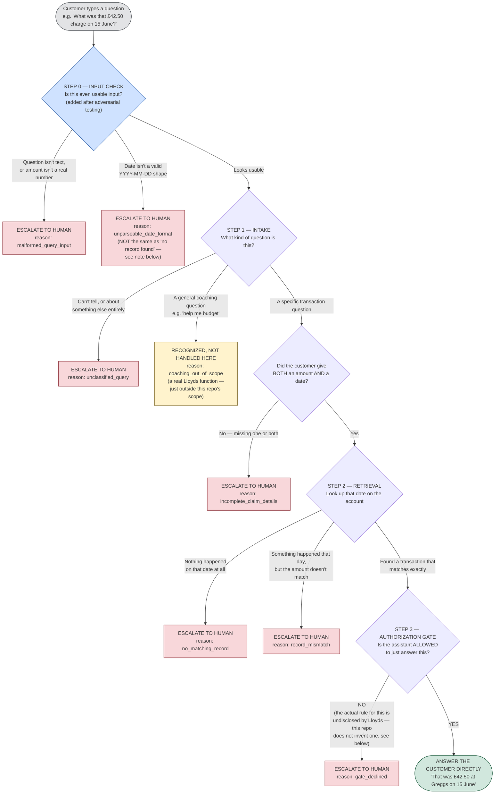

# Lloyds AI-Powered Financial Assistant — Illustrative Reference Pipeline

## What this is, in plain language

This is a small, working piece of software that **pretends to be** part of
Lloyds Banking Group's real customer-facing AI financial assistant — the
one announced 6 November 2025 and, per Lloyds' 22 June 2026 update, live
to over 500,000 Bank of Scotland customers.

It is **not** Lloyds' real system. Nobody outside Lloyds knows how their
real assistant actually works internally — Lloyds has only said *what it
does* (answers questions about your transactions, gives general financial
coaching, and can hand you off to a human when needed), never *how* it
decides when to answer you directly versus when to get a human involved.

This repository exists to make that gap concrete and testable rather than
just a sentence in a case study. It builds a small, fake, but fully
working version of "customer asks about a transaction → something
decides whether to answer or escalate to a human" — using entirely made-up
transaction data — so that the exact spot where Lloyds' public disclosure
runs out is a real piece of code you can point to, run, and try to break,
rather than just a claim in a document.

**If you take away only one thing from this README:** the most important
file in this whole project is `gate.py`, and the most important thing
about it is what it **refuses to do** — see "The Authorization Gate" below.

## Why this system, and not Lloyds' other AI tool (Athena)?

Lloyds also has a colleague-facing tool called Athena, which is
*much* better documented publicly (exact search-time figures, exact
usage numbers, three separate dated disclosures). We didn't build the
reference implementation around Athena, for one specific reason:

> With Athena, a human bank employee reviews every single answer before
> a customer ever hears it. Whatever Athena gets wrong, a person catches
> it before it reaches the customer.
>
> With the financial assistant modeled here, **there is no human in the
> loop by default** — it talks to the customer directly. Lloyds says it
> *can* refer a customer to a human "when needed," but never says what
> "needed" means.

That second situation — an AI system talking to a real customer directly,
with an undisclosed rule for when a human gets involved — is the
genuinely higher-stakes one. So that's the one this repository builds and
stress-tests.

---

## The workflow, visually

Every customer question that reaches this pipeline ends up in exactly one
of eight boxes below. Nothing falls through the cracks — every path is
tested (see "Test Coverage" further down). Two of these eight boxes
(`malformed_query_input` and `unparseable_date_format`) did not exist in
the first version of this pipeline — they were added after an
adversarial testing pass found real problems that either crashed the
program outright, or worse, produced a confident wrong answer. See "What
an adversarial pass actually found" below the test coverage table.



**Reading the diagram:** pink boxes are the seven distinct ways a query
gets handed to a human, each with its own reason code. The blue box is a
new validation checkpoint, added after real testing found problems, not
part of the pipeline's original design. The yellow box is a query the
pipeline correctly recognizes but deliberately doesn't try to handle (see
"Scope decision" below). The green box is the one path where the
customer gets an answer with no human involved at all. Every arrow in
this diagram corresponds to an actual, automated test — see "Test
Coverage."

**Why `unparseable_date_format` gets its own box instead of just becoming
`no_matching_record`:** those are two different claims about the world.
"We looked and found nothing" is a statement about the customer's
account. "We couldn't read the date you gave us" is a statement about the
input itself — the account might have exactly the transaction the
customer is asking about. Collapsing the two would mean occasionally
telling a real customer "nothing happened that day" when something
actually did. See the adversarial-testing section below for the exact
case that exposed this.

---

## The three steps, explained without code

**Step 1 — Intake.** The customer's question comes in as plain text (plus,
if they mentioned one, an amount and/or a date). This step's only job is
to sort the question into one of three buckets: "this is about a specific
transaction," "this is a general coaching question," or "I genuinely
can't tell." Real Lloyds systems presumably use a proper language model
for this; this repository uses simple keyword-matching (see `intake.py`)
because the *point* of this repository isn't to build a good classifier —
it's to build a good example of what happens *after* classification,
which is where Lloyds' actual disclosure gap lives.

**Step 2 — Retrieval.** Only transaction questions that included both an
amount and a date reach this step. It checks a (fake) transaction record
for that date and sees whether anything on that date matches the amount
the customer described. There are three possible outcomes, kept
deliberately distinct rather than lumped into one "not found": nothing
happened that day at all; something happened that day but the amount is
wrong; or it's a clean match.

**Step 3 — The Authorization Gate.** This only runs if Step 2 found a
clean match. This is the step this whole repository is built around. See
the next section — it deserves its own explanation.

### The Authorization Gate — the most important part of this repository

Lloyds has publicly said the assistant can "refer to expert human support
when needed." That's a category ("sometimes it hands off to a human") —
not a rule ("it hands off *when X happens*"). No dollar amount, no list of
sensitive topics, no confidence score, nothing. Lloyds has simply never
said.

Most software, faced with a gap like that, would fill it in with a
reasonable-sounding guess — "let's say it escalates for anything over
£500" — and move on. **This repository deliberately refuses to do that.**

The Gate (`gate.py`) contains **zero built-in rules**. On its own, it
cannot decide anything. If you try to build it without handing it an
outside decision-making function, it immediately throws an error and
refuses to start. It is *structurally incapable* of running without
someone else supplying the actual rule — which is the honest reflection
of the fact that nobody outside Lloyds actually knows what that rule is.

Every place in this pipeline where Lloyds *hasn't* told us the mechanism,
but a reasonable guess is at least clearly labeled as a guess (like the
keyword lists in Step 1, or the matching tolerance in Step 2), we marked
it `[DEV]` in the code — meaning "this is a made-up stand-in, and a real
implementation should revisit this." **The Gate doesn't even get a
`[DEV]`-labeled guess.** That absence is deliberate and is the single
most important design decision in this repository.

---

## File-by-file guide

If you've never read a small Python project before, here's the map. Each
entry says what the file is, in plain terms, and why it exists.

```
lloyds_financial_assistant/
├── README.md                          ← you are here
├── demo.py                            ← run this to see it work
├── lloyds_pipeline/                    ← the actual pipeline (the "product")
│   ├── __init__.py
│   ├── models.py                      ← defines the shapes of data
│   ├── intake.py                      ← Step 1
│   ├── mock_data.py                   ← the fake transaction records
│   ├── retrieval.py                   ← Step 2
│   ├── gate.py                        ← Step 3 (the Authorization Gate)
│   └── orchestrator.py                ← wires Steps 1-2-3 together in order
└── tests/                              ← proof that it actually works
    ├── __init__.py
    ├── test_intake.py
    ├── test_retrieval.py
    ├── test_gate.py
    ├── test_orchestrator_fail_fast.py
    ├── test_escalation_reasons.py
    └── test_happy_path.py
```

### `lloyds_pipeline/__init__.py`
An almost-empty file that exists purely so Python recognizes
`lloyds_pipeline` as a package (a folder of related code you can import
from elsewhere) rather than just a folder of loose scripts. It contains
only a comment explaining what the package is. You'll never need to open
this file to understand the project — it's plumbing.

### `lloyds_pipeline/models.py`
Defines the "shapes" of the data that flow through the pipeline — think
of these as labeled forms rather than active code. For example, a `Query`
is defined as "some text, plus optionally a claimed amount and a claimed
date" — that's it, that's all a customer question is allowed to look
like in this system. Every other file in the project passes data around
using these shapes, so this file is the shared vocabulary everything else
agrees on. If you're trying to understand what information moves between
steps, start here.

### `lloyds_pipeline/mock_data.py`
A small, entirely made-up list of fake transactions (a Greggs purchase,
an ASOS order, a rent payment, and so on) — a handful of pretend bank
statement lines. **None of this is real Lloyds customer data, or based
on any real Lloyds data.** It exists only so the pipeline has something
to look things up against; without it, "check the transaction record"
would have nothing to check against.

### `lloyds_pipeline/intake.py`
Does Step 1 (see above): reads the customer's question and decides if
it's about a transaction, about general coaching, or can't be
classified. It works by checking whether the question's words overlap
with two hand-picked lists of keywords (things like "charge," "payment,"
"withdrawal" for transactions; "budget," "save," "afford" for coaching).
This is explicitly a rough stand-in — real language understanding is far
more sophisticated — and the file says so in its own comments.

This file also does something it didn't originally do: it now checks,
before anything else, that the question is actually text (not a missing
value or the wrong data type) and that any claimed amount and date are
actually usable — a real number, and a real `YYYY-MM-DD` date shape.
That checking was added after deliberately trying to break the pipeline
with bad input found three real problems here. See "What an adversarial
pass actually found," below the test table.

### `lloyds_pipeline/retrieval.py`
Does Step 2: given a claimed amount and date, checks `mock_data.py`'s
fake transactions for that date and reports back one of three outcomes
(no transaction that day / a transaction that day but wrong amount / a
clean match). This is the file responsible for telling the difference
between "we found nothing" and "we found something, but it doesn't
match" — two situations this project treats as meaningfully different
kinds of failure, not one generic "couldn't find it."

### `lloyds_pipeline/gate.py`
Does Step 3 — see "The Authorization Gate" above for the full
explanation of why this file is the point of the whole repository. In
short: it holds no opinion of its own about when a query should be
answered directly versus handed to a human. It requires an outside
function to be handed to it, and it strictly checks that function's
answer makes sense (specifically: that it's a plain yes/no, nothing
else) — but it never invents the actual rule.

### `lloyds_pipeline/orchestrator.py`
The "conductor." This file doesn't do any of the actual thinking itself —
it just calls Step 1, then (if appropriate) Step 2, then (if appropriate)
Step 3, in that exact order, and stops immediately the moment any step
says "escalate." This matters more than it might sound: it guarantees
that, say, Step 3 (the Gate) is *never even asked* to make a decision
about a transaction that Step 2 already found didn't match — the system
fails fast and doesn't do unnecessary (or wrong) work. The tests in
`test_orchestrator_fail_fast.py` exist specifically to prove this
guarantee is real and not just an intention.

### `demo.py`
A small script you can run directly to see the whole pipeline work,
end to end, on six example questions — one for every possible outcome in
the diagram above. Running this is the fastest way to see the project
actually do something, without reading any other code first. See "How to
run it" below.

### The `tests/` folder, generally
Each file in this folder is a set of automated checks that run the code
above with specific, controlled inputs and confirm it behaves exactly as
claimed. Think of them as a checklist that gets run by a computer instead
of a person, and that fails loudly the instant something stops matching
the claim. They are what make "29 tests, 29 passing" in this README a
verifiable fact rather than an assertion you have to take on trust — you
can run them yourself (see below) and watch them pass.

- **`test_intake.py`** — checks Step 1 sorts questions into the right
  bucket, including the tricky case of a question that sounds like both
  a transaction question and a coaching question at once.
- **`test_retrieval.py`** — checks Step 2's three outcomes each actually
  happen under the right conditions, including correctly picking the
  right transaction when more than one happened on the same day.
- **`test_gate.py`** — checks the Gate's refusal behavior: that it won't
  even start without a real decision-making function handed to it, that
  it rejects a nonsense answer (anything that isn't a plain yes/no), and
  that it correctly follows whatever real yes/no answer it's given.
- **`test_orchestrator_fail_fast.py`** — the most important test file
  after `test_gate.py`. It proves that later steps are *never even
  called* once an earlier step has already decided to escalate — not
  just that the final answer looks right, but that, for example, Step 3
  is never consulted at all when Step 2 already found no match.
- **`test_escalation_reasons.py`** — walks through all six boxes in the
  diagram above, one at a time, and confirms each one is actually
  reachable with the correct label attached.
- **`test_happy_path.py`** — the one test that checks the "everything
  went fine" path, not a failure path: a clean question gets a correct,
  direct answer.

---

## What's confirmed vs. constructed vs. deliberately absent

**Confirmed** (sourced to Lloyds' 6 November 2025 press release and 22
June 2026 update — see Section 3.2 of the case study):
- The assistant answers customer questions about their own transactions.
- The assistant provides general financial coaching (not modeled in this repo — see below).
- The assistant can "refer to expert human support when needed."
- It is live, as of 22 June 2026, to over 500,000 Bank of Scotland customers.

Nothing else about how this system actually works, internally, is
confirmed by Lloyds anywhere in the public record reviewed for this case
study.

**Constructed** (this repository's own invented stand-ins, labeled
`[DEV]` in the code): the keyword lists in `intake.py`; the three-way
outcome and matching tolerance in `retrieval.py`; the fake transaction
data in `mock_data.py`.

**Deliberately absent — no stand-in at all:** the actual rule inside
`gate.py` for when the assistant is allowed to answer directly. Every
other gap got a labeled guess. This one didn't, on purpose. See "The
Authorization Gate" above for why.

**Scope decision, not an omission:** Lloyds confirms the assistant
handles general financial coaching questions as well as transaction
questions. This repository recognizes coaching questions correctly
(`recognized_not_modeled` / `coaching_out_of_scope`) but doesn't attempt
to model that path end to end — building it would mean inventing an
entire second, equally undisclosed mechanism, which this case study has
no evidentiary basis for.

---

## Test coverage

**49 tests, 49 passing, 0 failing**, across 7 files — verified twice: once
in the normal working environment, and again from a completely clean,
freshly created Python virtual environment with nothing else installed
in it (see "Sandboxed verification" below), to confirm the result isn't
an accident of leftover files or cached state.

| File | What it proves |
|---|---|
| `test_intake.py` | Classification correctly separates transaction / coaching / unclassifiable, including the both-keywords-present ambiguous case. |
| `test_retrieval.py` | The three-way retrieval outcome, including correct disambiguation among multiple same-day transactions. |
| `test_gate.py` | The Gate's contract: raises on missing/non-callable decision function, raises on non-bool return, honors both `True` and `False`, and passes context through unmodified. |
| `test_orchestrator_fail_fast.py` | Mock/spy assertions proving later stages are **never called** on an earlier escalation — not just that the final result looks right, but that Retrieval is skipped on an unclassifiable, coaching, or malformed query, and that the Gate is never consulted on `no_matching_record` or `record_mismatch`. |
| `test_escalation_reasons.py` | All eight terminal outcomes (six original + two added after the adversarial pass) are each independently reachable with the correct status/reason. |
| `test_happy_path.py` | The full clean-match resolution path works end to end, not only the halts. |
| `test_adversarial_edge_cases.py` | **Added after deliberately trying to break the pipeline** — see "What an adversarial pass actually found" below. Regression-proofs the three real defects that pass found, plus confirms several inputs that *look* dangerous (negative amounts, infinite amounts, a float boundary sitting exactly on the matching tolerance) were never actually broken. |

No test calls a real external API, model, or Lloyds system — everything
runs against the fabricated mock data in `mock_data.py`.

## What an adversarial pass actually found

The first version of this pipeline passed all 29 of its tests on the
first run — genuinely, no bugs were hit by that test suite. That's a
different claim from "the pipeline is correct," and the difference
matters: a test suite only proves the behavior it specifically checks
for. So, separately, this build was deliberately attacked with inputs no
existing test tried: wrong data types, malformed dates, boundary values,
`None`, `NaN`, infinity. That pass found three real problems, all now
fixed, all now covered by permanent regression tests so they can't
silently come back.

**1. A wrong-typed amount crashed the whole pipeline.** Passing the
*string* `"42.50"` instead of the *number* `42.50` — an entirely
plausible mistake for whatever system sits upstream of this one to make
— produced an unhandled `TypeError` the moment Retrieval tried to do
arithmetic on it. Nothing escalated. The program just broke.

**2. A missing or wrong-typed question crashed the pipeline the same
way.** `raw_text=None`, or a question passed in as a number instead of
text, crashed with `AttributeError` the instant Intake tried to call
`.lower()` on it.

**3. The most important one: a malformed date didn't crash — it lied.**
Claiming a transaction happened on `"2026-6-15"` instead of the stored
`"2026-06-15"` (missing a zero) didn't cause any error at all. It quietly
came back as `no_matching_record` — "nothing happened on that date" —
when in fact a transaction for that exact day *did* exist in the mock
data; the lookup just failed to recognize the date string. This is worse
than a crash: a crash is at least visible. This produced a plausible-
looking, confident, wrong answer. Fixing it meant adding a fourth outcome,
`unparseable_date_format`, so "we couldn't read the date you gave us" is
never confused with "we checked, and nothing happened that day" — the
same discipline this series applied elsewhere to keeping "no record
found" and "incomplete details" as separate, honestly-labeled outcomes
rather than one catch-all bucket.

**The fix, in one sentence:** `intake.py` now checks that a question is
actually text, that a claimed amount is actually a real, finite number
(explicitly rejecting `True`/`False`, which Python quietly treats as the
numbers 1 and 0, and rejecting `NaN`, which compares as "not equal" to
everything including itself), and that a claimed date matches a strict
`YYYY-MM-DD` shape — all *before* any of that data is used for
classification, lookup, or arithmetic, escalating to a human immediately
on failure rather than guessing or crashing.

**Things that looked risky but weren't, confirmed rather than assumed:**
a negative claimed amount (`-£42.50`) safely falls through to a normal
`record_mismatch` — it's a real number, just the wrong one. An infinite
amount behaves the same way. And the matching-tolerance boundary — a
claimed amount exactly `£0.01` away from a real transaction — was checked
directly against floating-point arithmetic (which doesn't always land on
exactly `0.01`) and confirmed to work correctly in both directions.

---

## How to run it

### Quick version (uses whatever Python is already set up)

```bash
# From inside the lloyds_financial_assistant/ folder:
python3 -m unittest discover -s tests -v   # runs all 29 tests, shows each one
python3 demo.py                              # runs the 6 example questions
```

### Sandboxed verification (proves it isn't relying on anything already installed on your machine)

This is the more rigorous version: it builds a brand-new, empty Python
environment (no packages, nothing pre-installed) in an isolated folder,
copies a cache-free copy of this repository into it, and runs everything
there. If it passes here, it will pass anywhere.

```bash
# Create a clean, empty environment:
python3 -m venv sandbox_venv

# Confirm it's genuinely empty (should list nothing but pip itself):
./sandbox_venv/bin/pip list

# Run the tests using ONLY that clean environment's Python:
./sandbox_venv/bin/python3 -m unittest discover -s tests -v

# Run the demo the same way:
./sandbox_venv/bin/python3 demo.py
```

This project has no third-party dependencies at all — everything it uses
(`dataclasses`, `unittest`, `unittest.mock`) is part of Python's own
standard library. The sandboxed run exists to prove that claim, not just
state it.

---

## Known limitations

- Classification (Step 1) is simple keyword-matching, not a real language
  model — built only to demonstrate the handoff between Step 1 and Step
  2, not to model Lloyds' actual natural-language understanding, which no
  source discloses.
- The fake transaction data is three dates / four transactions — enough to
  demonstrate every path in the diagram, nothing close to real scale.
- Nothing here handles multiple customers' questions arriving at once, or
  network delays, or retries — this is a simple, one-question-at-a-time
  pipeline, not production infrastructure.
- The matching tolerance and keyword lists are single invented values,
  not tuned against any real data.
- The date-format check requires a strict `YYYY-MM-DD` shape and rejects
  everything else outright. A real system would presumably accept
  several date formats gracefully; this scaffold deliberately picks one
  shape and refuses to guess at the rest, rather than building a
  permissive multi-format date parser this case study has no basis for
  attributing to Lloyds' real system.
- The adversarial pass documented above was not exhaustive — it is a
  demonstration that testing malformed input matters, not a certificate
  that no further defects exist. A more thorough audit might reasonably
  probe further: Unicode edge cases in the keyword matching, very long
  input strings, or dates that are validly formatted but nonsensical
  (e.g. 31 February).

## Explicit non-claims

This repository is **not** a disclosure of Lloyds Banking Group's actual
financial-assistant system. It does not claim Lloyds' system works this
way, uses this classification logic, this matching tolerance, or any
particular authorization rule, and should not be cited as evidence of
Lloyds' real technical architecture. It is an illustrative, tested
scaffold, built to be consistent with the functions Lloyds has actually
confirmed (Section 3.2 of the case study) and no richer than what those
confirmed functions support — with the Authorization Gate's total absence
of a built-in rule standing as the clearest, most deliberate expression
of exactly where Lloyds' public disclosure actually stops.
