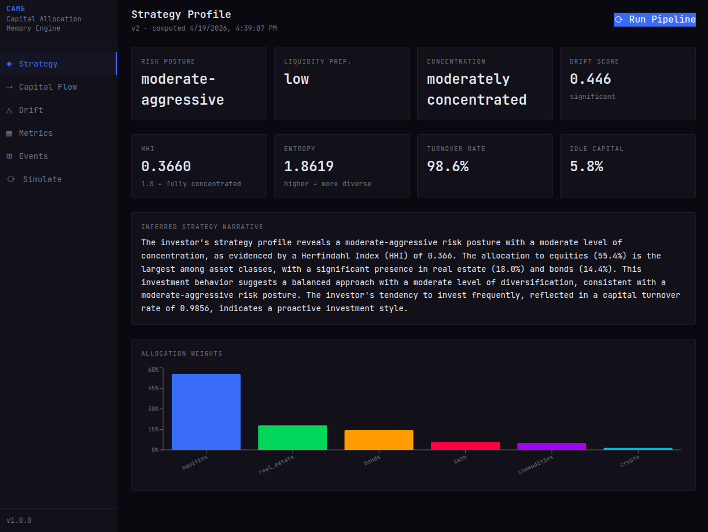

# CAME — Frontend

React dashboard for visualizing capital allocation behavior, strategy profiles, and drift.

## Setup

```bash
npm install
npm run dev
```

Proxies `/api` → `http://localhost:8000`. Backend must be running.

## Structure

```
src/
├── api/client.js          # Fetch wrapper for all API calls
├── store/index.js         # Zustand global state
├── components/
│   ├── layout/Sidebar.jsx
│   ├── MetricCard.jsx
│   └── charts/            # SankeyChart (D3), AllocationBar, MetricsLine (Recharts)
└── pages/
    ├── Strategy.jsx        # Strategy profile + Run Pipeline
    ├── Flow.jsx            # Capital flow Sankey
    ├── Drift.jsx           # Drift monitor + weight deltas
    ├── Metrics.jsx         # HHI, entropy, turnover, idle ratio history
    ├── Events.jsx          # Event timeline + ingest form
    └── Simulate.jsx        # Hypothetical allocation simulator
```

## Usage Flow

1. Go to **Events** — ingest financial events
2. Go to **Strategy** — click Run Pipeline to fire the LangGraph DAG
3. Ingest more events, run again — check **Drift** for behavioral delta
4. **Flow** — Sankey of where capital moved
5. **Simulate** — propose hypothetical events before committing

## Preview

