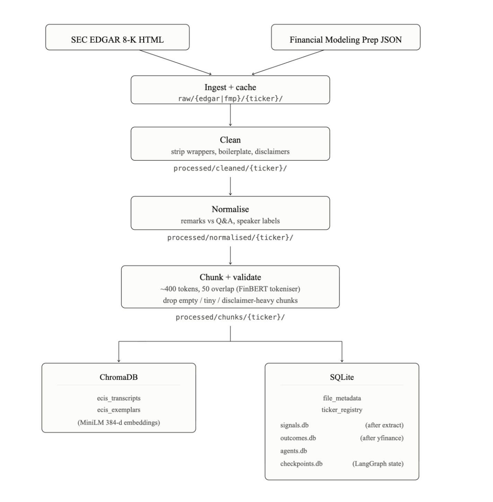

# Data flow

How a filing becomes chunks, embeddings, and database rows. Read more: [docs/workflow.md](../docs/workflow.md).

## Stages:

| Stage     | CLI                  | Input                   | Output                                     |
| --------- | -------------------- | ----------------------- | ------------------------------------------ |
| Ingest    | `--ingest`           | EDGAR / FMP APIs        | `raw/` + `file_metadata` + ticker registry |
| Clean     | `--preprocess`       | `raw/`                  | `processed/cleaned/`                       |
| Normalise | `--preprocess`       | cleaned text            | `processed/normalised/`                    |
| Chunk     | `--preprocess`       | normalised text         | `processed/chunks/` JSON                   |
| Embed     | `--preprocess`       | chunk JSON              | ChromaDB `ecis_transcripts`                |
| Extract   | `--extract`          | raw file                | `signals.db`                               |
| Outcomes  | `--resolve-outcomes` | signal dates + yfinance | `outcomes.db`                              |

`--preprocess` runs clean, normalise, chunk, and embed in that order.

`--ingest` only populates `raw/`. `--preprocess` builds the processed tree and embeddings for retrieval (few-shot exemplars, prior-quarter context, dashboard RAG). `--extract` runs the LangGraph pipeline on a raw file path: the graph cleans, chunks, and validates that file again, then readers vote.

Each chunk keeps ticker, transcript date, source path, section, speaker, chunk index, and character offsets. The pipeline prefers EDGAR `period_of_report` / FMP transcript date over the filename date when metadata exists.

SQLite: [src/ecis/db/README.md](../src/ecis/db/README.md). 

Chroma: [src/ecis/embedding/README.md](../src/ecis/embedding/README.md). 

Extraction: [docs/extraction.md](../docs/extraction.md).
