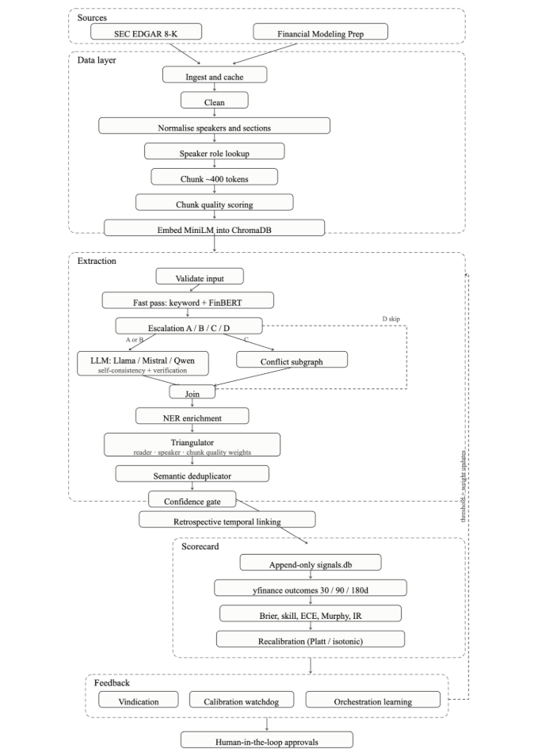

# Architecture Diagrams

Pipeline, component, and data-flow diagrams.

Current files live in this folder. Earlier architectures are in [previous/](previous/).

| File                                                               | Contents                                                    |
| ------------------------------------------------------------------ | ----------------------------------------------------------- |
| [ecis_system_architecture.png](ecis_system_architecture.png)       | End-to-end system: sources, extraction, Scorecard, feedback |
| [ecis_data_flow_architecture.png](ecis_data_flow_architecture.png) | Ingest → clean → chunk → ChromaDB / SQLite                  |
| [previous/](previous/)                                             | Prior system diagrams                                       |

- Written guides: [docs map](../README.md). 
- Workflow: [workflow.md](../workflow.md). 
- Data flow: `[data/flow.md](../../data/flow.md)`.
